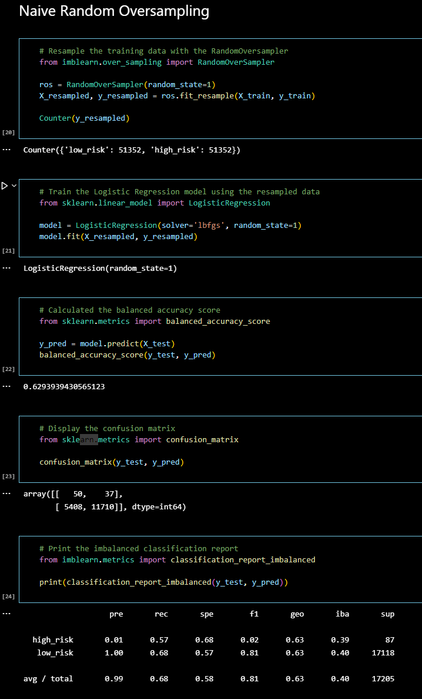

# Credit Risk Analysis

Using a credit card  dataset from LendingClub, a peer-to-peer lending services company, I ran an exploratory analysis to determin the best ML  technique to produce the strongest modle to predict high and low risk loans.  Non-esemble techniques included: RandomOverSampler, SMOTE, ClusterCentroids, and SMOTEENN algorythms.  Secondly, I comapred two ensamble models 1) BalancedRandomForestClassifier 2) EasyEnsembleAdaBoostClassifier to compare against the non-esemble modles.  

## Results
Since credit risk is important to detect and prevent, banks may value the sensitivity (recall) statistic when evaluating ML models.  Based on this assumption sensitivity and overall accuracy were used to determin the best fitting models from the variety of techniques used.  Based on this assumption, both ensemble models were the highest performing with BRC accuracy = 0.788 & recall = 0.87; BRC accuracy = 0.93 & recall = 0.94.  Looking at these results, we can make the conclusion that the EasyEnsembleAdaBoostClassifier is the best predictor for credit risk across all models.  One thing to consider is that these statistics are fairly high.  I might recommend retesting both ensembles over time to double check for overfitting. Please see the last section of this Readme for the result details for all techniques. 

## Summary
To predict credit risk, I recommend using the final technique tested, EasyEnsembleAdaBoostClassifier. 

## Result Outputs

### RandomOverSampler

### SMOTE

### ClusterCentroids

### SMOTEENN

### BalancedRandomForestClassifier

### EasyEnsembleClassifier

